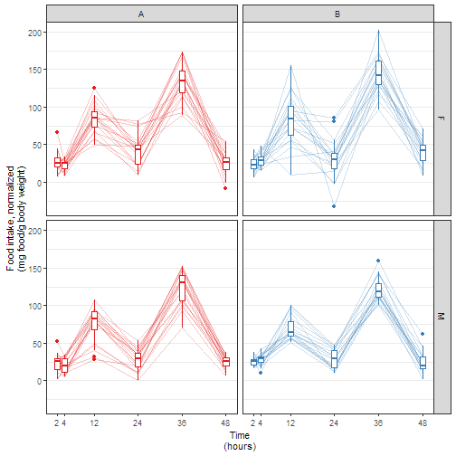

# Import data


```r
getwd()
```

```
## [1] "C:/Users/or0250652/Documents/Sandbox/BDP2-448-Lovasz"
```

```r
f <- "data/raw/Becky-Bedding Exposure Study Data for Stats.2.xlsx"
```

Import data file *data/raw/Becky-Bedding Exposure Study Data for Stats.2.xlsx*


```r
df <- f %>% read_excel()
```

```
## readxl works best with a newer version of the tibble package.
## You currently have tibble v1.4.2.
## Falling back to column name repair from tibble <= v1.4.2.
## Message displays once per session.
```

```r
oldnames <- names(df)
newnames <- c("id",
              "sex",
              "time",
              "bedding",
              "order",
              "room",
              "foodIntakeNormalized",
              "orts",
              "foodIntakeRaw",
              "cumulativeFoodIntakeNormalized")
names(df) <- newnames
data.frame(oldnames, newnames) %>% kable()
```


|oldnames                                         |newnames                       |
|:------------------------------------------------|:------------------------------|
|Mouse ID                                         |id                             |
|Sex                                              |sex                            |
|Time (hr)                                        |time                           |
|Bedding                                          |bedding                        |
|Order                                            |order                          |
|Housing Room                                     |room                           |
|Normalized food intake (mg food/g BW)            |foodIntakeNormalized           |
|Orts (g)                                         |orts                           |
|Raw food intake (g)                              |foodIntakeRaw                  |
|Normalized cumulative food intake (mg food/g BW) |cumulativeFoodIntakeNormalized |

Remove outlier


```r
df %>%
  dplyr::select(id, sex, time, bedding, foodIntakeNormalized) %>%
  filter(id == 42 & bedding == "B" & time %in% c(4, 12)) %>%
  kable()
```


| id|sex | time|bedding | foodIntakeNormalized|
|--:|:---|----:|:-------|--------------------:|
| 42|M   |    4|B       |            137.03382|
| 42|M   |   12|B       |            -63.03972|

```r
df <-
  df %>%
  filter(!(id == 42 & bedding == "B" & time %in% c(4, 12))) %>%
  mutate(hadOutlierRemoved = case_when(id == 42 & bedding == "B" ~ TRUE,
                                       TRUE ~ FALSE))
```

Plot data.


```r
G <-
  df %>%
  mutate(sex = factor(sex,
                      levels = c("F", "M"),
                      labels = c("Females", "Males")),
         bedding = factor(bedding,
                          levels = c("A", "B"),
                          labels = c("Control bedding", "Sick bedding"))) %>%
  ggplot() +
  aes(x = time, y = foodIntakeNormalized, color = bedding) +
  geom_line(aes(group = id, linetype = hadOutlierRemoved), alpha = 1/4) +
  geom_boxplot(aes(group = time)) +
  facet_grid(sex ~ bedding) +
  scale_color_brewer(palette = "Set1") +
  scale_x_continuous("Time\n(hours)", breaks = c(2, 4, 12, 24, 36, 48)) +
  scale_y_continuous("Food intake, normalized\n(mg food/g body weight)") +
  theme_bw() +
  theme(legend.position = "none",
        panel.grid.major.x = element_blank(),
        panel.grid.minor.x = element_blank())
ggsave("figures/lineplot.png", dpi = 300)
```

```
## Saving 7 x 7 in image
```

```r
ggsave("figures/lineplot.svg", dpi = 300)
```

```
## Saving 7 x 7 in image
```


```r
G
```




# New analysis

Prior analysis is archived in commit `f3ce92`.

On Thu, May 2, 2019 at 12:44 PM Becky Lovasz <lovasz@ohsu.edu> wrote:

> Hi Ben,
>  
> My project was put on the back burner for a while, and I'm picking it back up
> again. I discussed the results below with my research advisor. Can you please
> compare normalized food intake for Bedding A vs. Bedding B, regardless of
> bedding exposure order, at each time point separately? We'd like to see males
> only, females only, and all mice combined. Thanks for your help!


```r
random <- formula(~ 1 | id)
cs <-
  corSymm(form = random, fixed = FALSE) %>%
  Initialize(data = df)
ctrl <- lmeControl(opt = "optim",
                   maxIter = 500, msMaxIter = 500,
                   tolerance = 1e-6, niterEM = 25, msMaxEval = 200, msTol = 1e-7)
testContrast <- function (nlmeObj, contrast) {
  require(multcomp)
  g <- glht(nlmeObj, linfct = c(contrast)) %>% summary()
  x <- g[["test"]][["coefficients"]]
  dir <- ifelse(x > 0, "higher", "lower")
  s <- g[["test"]][["sigma"]]
  p <- g[["test"]][["pvalues"]][[1]]
  result <- data.frame(contrast = contrast,
                       coefficient = x,
                       sigma = s,
                       pvalue = p,
                       effsize = abs(x),
                       direction = dir,
                       stringsAsFactors = FALSE)
  rownames(result) <- NULL
  result
}
```

## All mice combined

Use `nlme::lme()`.
Specify a general correlation structure with `corSymm()`.
Use this output.


```r
fixed <- formula(foodIntakeNormalized ~
                   bedding +
                   time +
                   bedding * time)
M <-
  df %>%
  mutate(time = factor(time)) %>%
  lme(fixed, data = ., random = random, correlation = cs, control = ctrl)
M %>% 
  tidy() %>%
  filter(effect == "fixed") %>%
  kable(digits = 3)
```


|effect |group |term            | estimate| std.error|  df| statistic| p.value|
|:------|:-----|:---------------|--------:|---------:|---:|---------:|-------:|
|fixed  |fixed |(Intercept)     |   12.182|     1.971| 427|     6.182|   0.000|
|fixed  |fixed |beddingB        |   -0.291|     2.100| 427|    -0.139|   0.890|
|fixed  |fixed |time4           |   -3.184|     1.892| 427|    -1.682|   0.093|
|fixed  |fixed |time12          |   67.077|     3.266| 427|    20.537|   0.000|
|fixed  |fixed |time24          |   11.658|     2.607| 427|     4.473|   0.000|
|fixed  |fixed |time36          |  118.245|     3.143| 427|    37.628|   0.000|
|fixed  |fixed |time48          |    3.356|     2.949| 427|     1.138|   0.256|
|fixed  |fixed |beddingB:time4  |    6.196|     2.653| 427|     2.335|   0.020|
|fixed  |fixed |beddingB:time12 |   -1.019|     3.357| 427|    -0.303|   0.762|
|fixed  |fixed |beddingB:time24 |   -6.088|     2.437| 427|    -2.498|   0.013|
|fixed  |fixed |beddingB:time36 |    2.208|     3.820| 427|     0.578|   0.564|
|fixed  |fixed |beddingB:time48 |    5.748|     4.297| 427|     1.338|   0.182|

```r
testBeddingEffect <- 
  bind_rows(testContrast(M, "beddingB = 0"),
            testContrast(M, "beddingB + beddingB:time4 = 0"),
            testContrast(M, "beddingB + beddingB:time12 = 0"),
            testContrast(M, "beddingB + beddingB:time24 = 0"),
            testContrast(M, "beddingB + beddingB:time36 = 0"),
            testContrast(M, "beddingB + beddingB:time48 = 0"))
testBeddingEffect %>% kable(digits = 3)
```


|contrast                       | coefficient| sigma| pvalue| effsize|direction |
|:------------------------------|-----------:|-----:|------:|-------:|:---------|
|beddingB = 0                   |      -0.291| 2.100|  0.890|   0.291|lower     |
|beddingB + beddingB:time4 = 0  |       5.905| 1.746|  0.001|   5.905|higher    |
|beddingB + beddingB:time12 = 0 |      -1.310| 2.909|  0.652|   1.310|lower     |
|beddingB + beddingB:time24 = 0 |      -6.379| 2.487|  0.010|   6.379|lower     |
|beddingB + beddingB:time36 = 0 |       1.917| 3.458|  0.579|   1.917|higher    |
|beddingB + beddingB:time48 = 0 |       5.457| 3.034|  0.072|   5.457|higher    |

```r
test1 <- testBeddingEffect
```

## By sex

Use `nlme::lme()`.
Specify a general correlation structure with `corSymm()`.
Use this output.


```r
fixed <- formula(foodIntakeNormalized ~
                   bedding +
                   time +
                   sex +
                   bedding * time +
                   bedding * sex +
                   sex * time +
                   bedding * time * sex)
M <-
  df %>%
  mutate(time = factor(time)) %>%
  lme(fixed, data = ., random = random, correlation = cs, control = ctrl)
M %>% 
  tidy() %>%
  filter(effect == "fixed") %>%
  kable(digits = 3)
```


|effect |group |term                 | estimate| std.error|  df| statistic| p.value|
|:------|:-----|:--------------------|--------:|---------:|---:|---------:|-------:|
|fixed  |fixed |(Intercept)          |   14.698|     2.767| 416|     5.311|   0.000|
|fixed  |fixed |beddingB             |   -4.952|     2.802| 416|    -1.768|   0.078|
|fixed  |fixed |time4                |   -4.326|     2.681| 416|    -1.614|   0.107|
|fixed  |fixed |time12               |   70.560|     4.650| 416|    15.175|   0.000|
|fixed  |fixed |time24               |   16.355|     3.645| 416|     4.487|   0.000|
|fixed  |fixed |time36               |  122.365|     4.273| 416|    28.638|   0.000|
|fixed  |fixed |time48               |    0.087|     3.910| 416|     0.022|   0.982|
|fixed  |fixed |sexM                 |   -4.100|     3.904|  38|    -1.050|   0.300|
|fixed  |fixed |beddingB:time4       |    9.489|     3.728| 416|     2.545|   0.011|
|fixed  |fixed |beddingB:time12      |    2.839|     4.687| 416|     0.606|   0.545|
|fixed  |fixed |beddingB:time24      |   -7.135|     3.469| 416|    -2.057|   0.040|
|fixed  |fixed |beddingB:time36      |    7.887|     5.426| 416|     1.453|   0.147|
|fixed  |fixed |beddingB:time48      |   19.180|     5.432| 416|     3.531|   0.000|
|fixed  |fixed |beddingB:sexM        |    9.316|     3.954| 416|     2.356|   0.019|
|fixed  |fixed |time4:sexM           |    2.378|     3.793| 416|     0.627|   0.531|
|fixed  |fixed |time12:sexM          |   -8.408|     6.503| 416|    -1.293|   0.197|
|fixed  |fixed |time24:sexM          |  -10.783|     5.073| 416|    -2.126|   0.034|
|fixed  |fixed |time36:sexM          |  -11.048|     6.020| 416|    -1.835|   0.067|
|fixed  |fixed |time48:sexM          |    5.642|     5.522| 416|     1.022|   0.307|
|fixed  |fixed |beddingB:time4:sexM  |   -6.472|     5.288| 416|    -1.224|   0.222|
|fixed  |fixed |beddingB:time12:sexM |   -7.957|     6.640| 416|    -1.198|   0.231|
|fixed  |fixed |beddingB:time24:sexM |    2.378|     4.906| 416|     0.485|   0.628|
|fixed  |fixed |beddingB:time36:sexM |  -10.744|     7.647| 416|    -1.405|   0.161|
|fixed  |fixed |beddingB:time48:sexM |  -26.611|     7.658| 416|    -3.475|   0.001|

```r
testBeddingEffect <- 
  bind_rows(testContrast(M, "beddingB = 0"),
            testContrast(M, "beddingB + beddingB:time4 = 0"),
            testContrast(M, "beddingB + beddingB:time12 = 0"),
            testContrast(M, "beddingB + beddingB:time24 = 0"),
            testContrast(M, "beddingB + beddingB:time36 = 0"),
            testContrast(M, "beddingB + beddingB:time48 = 0"),
            testContrast(M, "beddingB + beddingB:sexM = 0"),
            testContrast(M, "beddingB + beddingB:sexM + beddingB:time4:sexM = 0"),
            testContrast(M, "beddingB + beddingB:sexM + beddingB:time12:sexM = 0"),
            testContrast(M, "beddingB + beddingB:sexM + beddingB:time24:sexM = 0"),
            testContrast(M, "beddingB + beddingB:sexM + beddingB:time36:sexM = 0"),
            testContrast(M, "beddingB + beddingB:sexM + beddingB:time48:sexM = 0"))
testBeddingEffect %>% kable(digits = 3)
```


|contrast                                            | coefficient| sigma| pvalue| effsize|direction |
|:---------------------------------------------------|-----------:|-----:|------:|-------:|:---------|
|beddingB = 0                                        |      -4.952| 2.802|  0.077|   4.952|lower     |
|beddingB + beddingB:time4 = 0                       |       4.537| 2.484|  0.068|   4.537|higher    |
|beddingB + beddingB:time12 = 0                      |      -2.114| 4.153|  0.611|   2.114|lower     |
|beddingB + beddingB:time24 = 0                      |     -12.087| 3.335|  0.000|  12.087|lower     |
|beddingB + beddingB:time36 = 0                      |       2.935| 5.074|  0.563|   2.935|higher    |
|beddingB + beddingB:time48 = 0                      |      14.227| 4.000|  0.000|  14.227|higher    |
|beddingB + beddingB:sexM = 0                        |       4.364| 2.790|  0.118|   4.364|higher    |
|beddingB + beddingB:sexM + beddingB:time4:sexM = 0  |      -2.107| 4.498|  0.639|   2.107|lower     |
|beddingB + beddingB:sexM + beddingB:time12:sexM = 0 |      -3.593| 6.294|  0.568|   3.593|lower     |
|beddingB + beddingB:sexM + beddingB:time24:sexM = 0 |       6.742| 4.810|  0.161|   6.742|higher    |
|beddingB + beddingB:sexM + beddingB:time36:sexM = 0 |      -6.380| 7.394|  0.388|   6.380|lower     |
|beddingB + beddingB:sexM + beddingB:time48:sexM = 0 |     -22.247| 6.732|  0.001|  22.247|lower     |

```r
test2 <- testBeddingEffect
```


# Interpretation

Using a model that does not distinguish male and female mice, there is a
slight difference in food intake by bedding type at 24 and 48 hours.
At 24 hours, food intake is
6.38 mg/g
lower
with bedding type B compared to A
(p-value: 0.01).
At 48 hours, food intake is
5.46 mg/g
higher
with bedding type B compared to A
(p-value: 0.072).

Among female mice, there is a difference in food intake by bedding type at 24
and 48 hours.
At 24 hours, food intake is
12.1 mg/g
lower
with bedding type B compared to A
(p-value: 0.00029).
At 48 hours, food intake is
14.2 mg/g
higher
with bedding type B compared to A
(p-value: 0.00038).

Among male mice, there is a difference in food intake by bedding type at 2 and 48 hours.
At 2 hours, food intake is
4.36 mg/g
higher
with bedding type B compared to A
(p-value: 0.12).
At 48 hours, food intake is
22.2 mg/g
lower
with bedding type B compared to A
(p-value: 0.00095).


# R session information

For debugging purposes.


```
## [1] "Run time: 2019-08-05 09:18:33"
```

```
## R version 3.5.3 (2019-03-11)
## Platform: x86_64-w64-mingw32/x64 (64-bit)
## Running under: Windows 10 x64 (build 17134)
## 
## Matrix products: default
## 
## attached base packages:
## [1] stats     graphics  grDevices utils     datasets  methods   base     
## 
## other attached packages:
##  [1] gdtools_0.1.7     bindrcpp_0.2.2    multcomp_1.4-8   
##  [4] TH.data_1.0-9     MASS_7.3-51.1     survival_2.43-3  
##  [7] mvtnorm_1.0-8     broom.mixed_0.2.3 nlme_3.1-137     
## [10] lme4_1.1-19       Matrix_1.2-15     svglite_1.2.1    
## [13] broom_0.5.1       readxl_1.2.0      forcats_0.3.0    
## [16] stringr_1.3.1     dplyr_0.7.8       purrr_0.2.5      
## [19] readr_1.3.1       tidyr_0.8.2       tibble_1.4.2     
## [22] ggplot2_3.1.0     tidyverse_1.2.1   magrittr_1.5     
## [25] checkpoint_0.4.5  rmarkdown_1.12    knitr_1.22       
## 
## loaded via a namespace (and not attached):
##  [1] Rcpp_1.0.1         lubridate_1.7.4    lattice_0.20-38   
##  [4] zoo_1.8-4          assertthat_0.2.0   digest_0.6.18     
##  [7] R6_2.3.0           cellranger_1.1.0   plyr_1.8.4        
## [10] backports_1.1.3    evaluate_0.13      coda_0.19-2       
## [13] highr_0.7          httr_1.4.0         pillar_1.3.1      
## [16] rlang_0.3.0.1      lazyeval_0.2.1     rstudioapi_0.8    
## [19] minqa_1.2.4        nloptr_1.2.1       labeling_0.3      
## [22] splines_3.5.3      TMB_1.7.15         munsell_0.5.0     
## [25] compiler_3.5.3     modelr_0.1.2       xfun_0.6          
## [28] pkgconfig_2.0.2    htmltools_0.3.6    tidyselect_0.2.5  
## [31] glmmTMB_0.2.2.0    codetools_0.2-16   crayon_1.3.4      
## [34] withr_2.1.2        grid_3.5.3         jsonlite_1.6      
## [37] gtable_0.2.0       scales_1.0.0       cli_1.0.1         
## [40] stringi_1.2.4      reshape2_1.4.3     xml2_1.2.0        
## [43] generics_0.0.2     sandwich_2.5-0     RColorBrewer_1.1-2
## [46] tools_3.5.3        glue_1.3.0         hms_0.4.2         
## [49] colorspace_1.3-2   rvest_0.3.2        bindr_0.1.1       
## [52] haven_2.0.0
```
