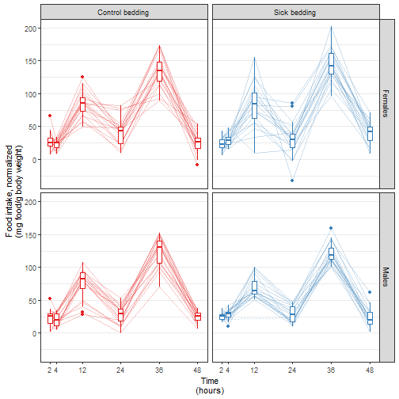

# Import data


```r
getwd()
```

```
## [1] "C:/Users/Ben/Google Drive/Work/BDP2-448-Lovasz"
```

```r
f <- "data/raw/Becky-Bedding Exposure Study Data for Stats.2.xlsx"
```

Import data file *data/raw/Becky-Bedding Exposure Study Data for Stats.2.xlsx*


```r
df <- f %>% read_excel()
```

```
## readxl works best with a newer version of the tibble package.
## You currently have tibble v1.4.2.
## Falling back to column name repair from tibble <= v1.4.2.
## Message displays once per session.
```

```r
oldnames <- names(df)
newnames <- c("id",
              "sex",
              "time",
              "bedding",
              "order",
              "room",
              "foodIntakeNormalized",
              "orts",
              "foodIntakeRaw",
              "cumulativeFoodIntakeNormalized")
names(df) <- newnames
data.frame(oldnames, newnames) %>% kable()
```


|oldnames                                         |newnames                       |
|:------------------------------------------------|:------------------------------|
|Mouse ID                                         |id                             |
|Sex                                              |sex                            |
|Time (hr)                                        |time                           |
|Bedding                                          |bedding                        |
|Order                                            |order                          |
|Housing Room                                     |room                           |
|Normalized food intake (mg food/g BW)            |foodIntakeNormalized           |
|Orts (g)                                         |orts                           |
|Raw food intake (g)                              |foodIntakeRaw                  |
|Normalized cumulative food intake (mg food/g BW) |cumulativeFoodIntakeNormalized |

Plot data.


```r
G <-
  df %>%
  ggplot() +
  aes(x = time, y = foodIntakeNormalized, color = bedding) +
  geom_line(aes(group = id), alpha = 1/4) +
  geom_boxplot(aes(group = time)) +
  facet_grid(sex ~ bedding) +
  scale_color_brewer(palette = "Set1") +
  scale_x_continuous("Time\n(hours)", breaks = c(2, 4, 12, 24, 36, 48)) +
  scale_y_continuous("Food intake, normalized\n(mg food/g body weight)") +
  theme_bw() +
  theme(legend.position = "none",
        panel.grid.major.x = element_blank(),
        panel.grid.minor.x = element_blank())
ggsave("figures/lineplot.png", dpi = 300)
```

```
## Saving 7 x 7 in image
```

```r
ggsave("figures/lineplot.svg", dpi = 300)
```

```
## Saving 7 x 7 in image
```

```
## Warning: package 'gdtools' was built under R version 3.5.2
```


```r
G
```




# New analysis

Prior analysis is archived in commit `f3ce92`.

On Thu, May 2, 2019 at 12:44 PM Becky Lovasz <lovasz@ohsu.edu> wrote:

> Hi Ben,
>  
> My project was put on the back burner for a while, and I'm picking it back up
> again. I discussed the results below with my research advisor. Can you please
> compare normalized food intake for Bedding A vs. Bedding B, regardless of
> bedding exposure order, at each time point separately? We'd like to see males
> only, females only, and all mice combined. Thanks for your help!


```r
random <- formula(~ 1 | id)
cs <-
  corSymm(form = random, fixed = FALSE) %>%
  Initialize(data = df)
ctrl <- lmeControl(opt = "optim",
                   maxIter = 500, msMaxIter = 500,
                   tolerance = 1e-6, niterEM = 25, msMaxEval = 200, msTol = 1e-7)
testContrast <- function (nlmeObj, contrast) {
  require(multcomp)
  g <- glht(nlmeObj, linfct = c(contrast)) %>% summary()
  x <- g[["test"]][["coefficients"]]
  dir <- ifelse(x > 0, "higher", "lower")
  s <- g[["test"]][["sigma"]]
  p <- g[["test"]][["pvalues"]][[1]]
  result <- data.frame(contrast = contrast,
                       coefficient = x,
                       sigma = s,
                       pvalue = p,
                       effsize = abs(x),
                       direction = dir,
                       stringsAsFactors = FALSE)
  rownames(result) <- NULL
  result
}
```

## All mice combined

Use `nlme::lme()`.
Specify a general correlation structure with `corSymm()`.
Use this output.


```r
fixed <- formula(foodIntakeNormalized ~
                   bedding +
                   time +
                   bedding * time)
M <-
  df %>%
  mutate(time = factor(time)) %>%
  lme(fixed, data = ., random = random, correlation = cs, control = ctrl)
```

```
## Warning: package 'bindrcpp' was built under R version 3.5.2
```

```r
M %>% 
  tidy() %>%
  filter(effect == "fixed") %>%
  kable(digits = 3)
```


|effect |group |term            | estimate| std.error|  df| statistic| p.value|
|:------|:-----|:---------------|--------:|---------:|---:|---------:|-------:|
|fixed  |fixed |(Intercept)     |   11.018|     2.123| 429|     5.191|   0.000|
|fixed  |fixed |beddingB        |    0.427|     2.074| 429|     0.206|   0.837|
|fixed  |fixed |time4           |   -0.778|     2.183| 429|    -0.357|   0.722|
|fixed  |fixed |time12          |   66.280|     3.364| 429|    19.704|   0.000|
|fixed  |fixed |time24          |   12.518|     2.690| 429|     4.653|   0.000|
|fixed  |fixed |time36          |  118.356|     3.356| 429|    35.265|   0.000|
|fixed  |fixed |time48          |    3.367|     2.938| 429|     1.146|   0.252|
|fixed  |fixed |beddingB:time4  |    3.590|     3.256| 429|     1.103|   0.271|
|fixed  |fixed |beddingB:time12 |   -0.494|     3.649| 429|    -0.135|   0.892|
|fixed  |fixed |beddingB:time24 |   -6.888|     2.552| 429|    -2.699|   0.007|
|fixed  |fixed |beddingB:time36 |    1.774|     3.874| 429|     0.458|   0.647|
|fixed  |fixed |beddingB:time48 |    5.941|     4.294| 429|     1.383|   0.167|

```r
testBeddingEffect <- 
  bind_rows(testContrast(M, "beddingB = 0"),
            testContrast(M, "beddingB + beddingB:time4 = 0"),
            testContrast(M, "beddingB + beddingB:time12 = 0"),
            testContrast(M, "beddingB + beddingB:time24 = 0"),
            testContrast(M, "beddingB + beddingB:time36 = 0"),
            testContrast(M, "beddingB + beddingB:time48 = 0"))
testBeddingEffect %>% kable(digits = 3)
```


|contrast                       | coefficient| sigma| pvalue| effsize|direction |
|:------------------------------|-----------:|-----:|------:|-------:|:---------|
|beddingB = 0                   |       0.427| 2.074|  0.837|   0.427|higher    |
|beddingB + beddingB:time4 = 0  |       4.017| 2.455|  0.102|   4.017|higher    |
|beddingB + beddingB:time12 = 0 |      -0.067| 3.318|  0.984|   0.067|lower     |
|beddingB + beddingB:time24 = 0 |      -6.461| 2.570|  0.012|   6.461|lower     |
|beddingB + beddingB:time36 = 0 |       2.201| 3.426|  0.521|   2.201|higher    |
|beddingB + beddingB:time48 = 0 |       6.367| 3.046|  0.037|   6.367|higher    |

```r
test1 <- testBeddingEffect
```

## By sex

Use `nlme::lme()`.
Specify a general correlation structure with `corSymm()`.
Use this output.


```r
fixed <- formula(foodIntakeNormalized ~
                   bedding +
                   time +
                   sex +
                   bedding * time +
                   bedding * sex +
                   sex * time +
                   bedding * time * sex)
M <-
  df %>%
  mutate(time = factor(time)) %>%
  lme(fixed, data = ., random = random, correlation = cs, control = ctrl)
M %>% 
  tidy() %>%
  filter(effect == "fixed") %>%
  kable(digits = 3)
```


|effect |group |term                 | estimate| std.error|  df| statistic| p.value|
|:------|:-----|:--------------------|--------:|---------:|---:|---------:|-------:|
|fixed  |fixed |(Intercept)          |   13.760|     2.966| 418|     4.640|   0.000|
|fixed  |fixed |beddingB             |   -4.249|     2.739| 418|    -1.552|   0.122|
|fixed  |fixed |time4                |   -1.033|     3.123| 418|    -0.331|   0.741|
|fixed  |fixed |time12               |   68.281|     4.688| 418|    14.564|   0.000|
|fixed  |fixed |time24               |   17.025|     3.692| 418|     4.611|   0.000|
|fixed  |fixed |time36               |  123.016|     4.507| 418|    27.296|   0.000|
|fixed  |fixed |time48               |    0.022|     3.882| 418|     0.006|   0.996|
|fixed  |fixed |sexM                 |   -4.488|     4.194|  38|    -1.070|   0.291|
|fixed  |fixed |beddingB:time4       |    4.852|     4.618| 418|     1.051|   0.294|
|fixed  |fixed |beddingB:time12      |    5.986|     4.989| 418|     1.200|   0.231|
|fixed  |fixed |beddingB:time24      |   -8.713|     3.585| 418|    -2.430|   0.016|
|fixed  |fixed |beddingB:time36      |    6.814|     5.489| 418|     1.241|   0.215|
|fixed  |fixed |beddingB:time48      |   19.092|     5.376| 418|     3.551|   0.000|
|fixed  |fixed |beddingB:sexM        |    9.708|     3.873| 418|     2.507|   0.013|
|fixed  |fixed |time4:sexM           |    0.060|     4.417| 418|     0.014|   0.989|
|fixed  |fixed |time12:sexM          |   -5.604|     6.631| 418|    -0.845|   0.399|
|fixed  |fixed |time24:sexM          |  -11.136|     5.222| 418|    -2.132|   0.034|
|fixed  |fixed |time36:sexM          |  -12.754|     6.374| 418|    -2.001|   0.046|
|fixed  |fixed |time48:sexM          |    5.882|     5.490| 418|     1.071|   0.285|
|fixed  |fixed |beddingB:time4:sexM  |   -2.514|     6.531| 418|    -0.385|   0.701|
|fixed  |fixed |beddingB:time12:sexM |  -13.611|     7.056| 418|    -1.929|   0.054|
|fixed  |fixed |beddingB:time24:sexM |    4.052|     5.070| 418|     0.799|   0.425|
|fixed  |fixed |beddingB:time36:sexM |  -10.179|     7.763| 418|    -1.311|   0.191|
|fixed  |fixed |beddingB:time48:sexM |  -27.071|     7.603| 418|    -3.560|   0.000|

```r
testBeddingEffect <- 
  bind_rows(testContrast(M, "beddingB = 0"),
            testContrast(M, "beddingB + beddingB:time4 = 0"),
            testContrast(M, "beddingB + beddingB:time12 = 0"),
            testContrast(M, "beddingB + beddingB:time24 = 0"),
            testContrast(M, "beddingB + beddingB:time36 = 0"),
            testContrast(M, "beddingB + beddingB:time48 = 0"),
            testContrast(M, "beddingB + beddingB:sexM = 0"),
            testContrast(M, "beddingB + beddingB:sexM + beddingB:time4:sexM = 0"),
            testContrast(M, "beddingB + beddingB:sexM + beddingB:time12:sexM = 0"),
            testContrast(M, "beddingB + beddingB:sexM + beddingB:time24:sexM = 0"),
            testContrast(M, "beddingB + beddingB:sexM + beddingB:time36:sexM = 0"),
            testContrast(M, "beddingB + beddingB:sexM + beddingB:time48:sexM = 0"))
testBeddingEffect %>% kable(digits = 3)
```


|contrast                                            | coefficient| sigma| pvalue| effsize|direction |
|:---------------------------------------------------|-----------:|-----:|------:|-------:|:---------|
|beddingB = 0                                        |      -4.249| 2.739|  0.121|   4.249|lower     |
|beddingB + beddingB:time4 = 0                       |       0.603| 3.425|  0.860|   0.603|higher    |
|beddingB + beddingB:time12 = 0                      |       1.737| 4.712|  0.712|   1.737|higher    |
|beddingB + beddingB:time24 = 0                      |     -12.962| 3.365|  0.000|  12.962|lower     |
|beddingB + beddingB:time36 = 0                      |       2.565| 4.985|  0.607|   2.565|higher    |
|beddingB + beddingB:time48 = 0                      |      14.843| 3.993|  0.000|  14.843|higher    |
|beddingB + beddingB:sexM = 0                        |       5.459| 2.739|  0.046|   5.459|higher    |
|beddingB + beddingB:sexM + beddingB:time4:sexM = 0  |       2.946| 5.749|  0.608|   2.946|higher    |
|beddingB + beddingB:sexM + beddingB:time12:sexM = 0 |      -8.152| 6.862|  0.235|   8.152|lower     |
|beddingB + beddingB:sexM + beddingB:time24:sexM = 0 |       9.511| 4.917|  0.053|   9.511|higher    |
|beddingB + beddingB:sexM + beddingB:time36:sexM = 0 |      -4.719| 7.415|  0.525|   4.719|lower     |
|beddingB + beddingB:sexM + beddingB:time48:sexM = 0 |     -21.612| 6.697|  0.001|  21.612|lower     |

```r
test2 <- testBeddingEffect
```


# Interpretation

Using a model that does not distinguish male and female mice, there is a
slight difference in food intake by bedding type at 24 and 48 hours.
At 24 hours, food intake is
6.46 mg/g
lower
with bedding type B compared to A
(p-value: 0.012).
At 48 hours, food intake is
6.37 mg/g
higher
with bedding type B compared to A
(p-value: 0.037).

Among female mice, there is a difference in food intake by bedding type at 24
and 48 hours.
At 24 hours, food intake is
13 mg/g
lower
with bedding type B compared to A
(p-value: 0.00012).
At 48 hours, food intake is
14.8 mg/g
higher
with bedding type B compared to A
(p-value: 0.0002).

Among male mice, there is a difference in food intake by bedding type at 2 and 48 hours.
At 2 hours, food intake is
5.46 mg/g
higher
with bedding type B compared to A
(p-value: 0.046).
At 48 hours, food intake is
21.6 mg/g
lower
with bedding type B compared to A
(p-value: 0.0013).


# R session information

For debugging purposes.


```
## [1] "Run time: 2019-05-23 20:56:39"
```

```
## R version 3.5.1 (2018-07-02)
## Platform: x86_64-w64-mingw32/x64 (64-bit)
## Running under: Windows 10 x64 (build 17134)
## 
## Matrix products: default
## 
## attached base packages:
## [1] stats     graphics  grDevices utils     datasets  methods   base     
## 
## other attached packages:
##  [1] bindrcpp_0.2.2    gdtools_0.1.7     multcomp_1.4-8   
##  [4] TH.data_1.0-9     MASS_7.3-50       survival_2.43-3  
##  [7] mvtnorm_1.0-8     broom.mixed_0.2.3 nlme_3.1-137     
## [10] lme4_1.1-19       Matrix_1.2-14     svglite_1.2.1    
## [13] broom_0.5.1       readxl_1.2.0      forcats_0.3.0    
## [16] stringr_1.3.1     dplyr_0.7.8       purrr_0.2.5      
## [19] readr_1.3.1       tidyr_0.8.2       tibble_1.4.2     
## [22] ggplot2_3.1.0     tidyverse_1.2.1   magrittr_1.5     
## [25] checkpoint_0.4.5  rmarkdown_1.11    knitr_1.21       
## 
## loaded via a namespace (and not attached):
##  [1] Rcpp_0.12.19       lubridate_1.7.4    lattice_0.20-35   
##  [4] zoo_1.8-4          assertthat_0.2.0   digest_0.6.18     
##  [7] R6_2.3.0           cellranger_1.1.0   plyr_1.8.4        
## [10] backports_1.1.3    evaluate_0.12      coda_0.19-2       
## [13] highr_0.7          httr_1.4.0         pillar_1.3.1      
## [16] rlang_0.3.0.1      lazyeval_0.2.1     rstudioapi_0.8    
## [19] minqa_1.2.4        nloptr_1.2.1       labeling_0.3      
## [22] splines_3.5.1      TMB_1.7.15         munsell_0.5.0     
## [25] compiler_3.5.1     modelr_0.1.2       xfun_0.4          
## [28] pkgconfig_2.0.2    htmltools_0.3.6    tidyselect_0.2.5  
## [31] glmmTMB_0.2.2.0    codetools_0.2-15   crayon_1.3.4      
## [34] withr_2.1.2        grid_3.5.1         jsonlite_1.6      
## [37] gtable_0.2.0       scales_1.0.0       cli_1.0.1         
## [40] stringi_1.2.4      reshape2_1.4.3     xml2_1.2.0        
## [43] generics_0.0.2     sandwich_2.5-0     RColorBrewer_1.1-2
## [46] tools_3.5.1        glue_1.3.0         hms_0.4.2         
## [49] colorspace_1.3-2   rvest_0.3.2        bindr_0.1.1       
## [52] haven_2.0.0
```
